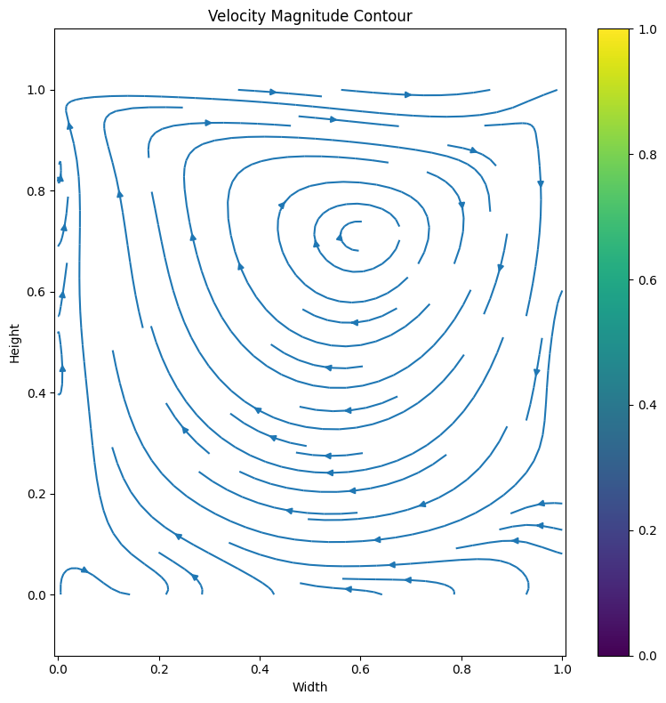
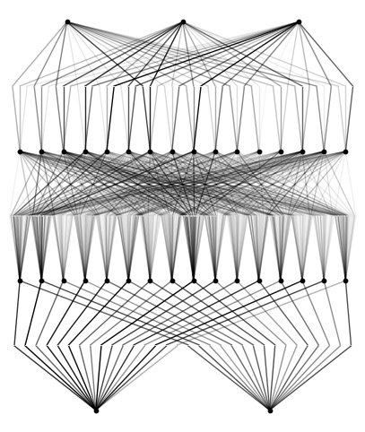

A simple KAN implementation for cavity flow at Re=100
Here is the main result from KAN_Cavity.ipynb. You can run kanc.py to get the same result as well.


Requirements:
```
 python==3.9.7
 matplotlib==3.6.2
 numpy==1.24.4
 scikit_learn==1.1.3
 setuptools==65.5.0
 sympy==1.11.1
 torch==2.2.2
 tqdm==4.66.2
```

You may also need SciencePlot and Latex.
```
 pip install SciencePlot
 pip install Latex
```

You may also need tensorboard.
```
 pip install tensorboard
```


The trained model is saved in model.pt


For more details please see: 
https://github.com/HangJin13/pykan/tree/master


Main results:




First graph shows the numerical solution of NS functions solved by KAN.
Each line is the velocity magnitude.
We iterate 250 times and get this solution.


This graph is the value of current loss function vs iteration times.


<!-- ![image]
This graph is a "weak" numerical solution of NS functions. We iterate 100 times to get this solution. The current loss value is the same as above. -->





This graph shows the model of KAN.